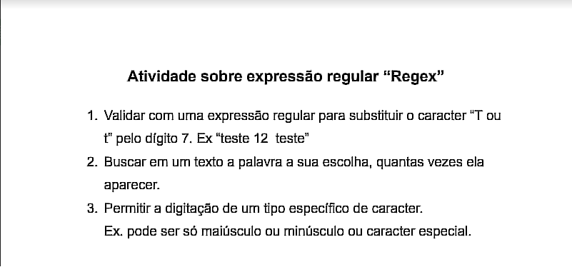

# Regex

> No dia 13 de Julho, foi introduzido o conceito do *Regex*, que trabalha com padrão de textos/strings.
 
> Dito isso, junto da aula e documentação sobre o assunto, contendo conceitos e explicações, foi pedido uma atividade contendo três propostas de algoritimos que devem ser feitas:

> Com a atividade, e conhecimento básico em Javascript, o resultado das minhas respostas foi:

~~~javascript
// Funções
function trocaCaractereTporSete(textoTroca){
    let n = textoTroca.replace(/t+/ig, "7");
    console.log(n);
}

function regexBuscaPalavra(texto){
    const textin = texto.match(/mãe+/ig).length;
    console.log(textin);
}

function soPodeMaiusculo(textoMaiusculo){
    if(/^[A-Z]+$/.test(textoMaiusculo)){
        console.log(textoMaiusculo);
    } else {
        console.log("O texto precisa ser maiúsculo");
    }
}

// Testes com funções
trocaCaractereTporSete("Tranquilo?");
regexBuscaPalavra("Oi mãe! Tô na televisão mãe!");
soPodeMaiusculo("SALVE");
~~~

# [Link para acessar o repositório da atividade](https://github.com/ArthurOReis/regexJS/blob/main/main.js)