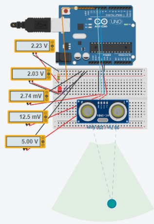
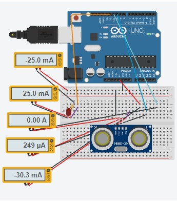

# Multímetro

> Com a introdução e exploração de circuitos e Arduinos, foi proposto uma atividade no dia 10 de Agosto, onde o aluno, junto de seu Arduino com sensor de distância que criou na aula, deverá abri-lo, para medir a tensão e a corrente, usando diferentes multímetros. Dessa forma, ao realizar a atividade, o resultado foi:

## Medindo tensão

## Medindo corrente

# Código C++ usado no projeto:

~~~arduino
float cm,duracao; // comprimento da onda

int pinoTransmissor=10;
int pinoReceptor=11;
int led=12;

void setup(){
  pinMode(pinoTransmissor, OUTPUT);
  pinMode(pinoReceptor, INPUT);    
  pinMode(led, OUTPUT);
  Serial.begin(9600);
}

void loop(){
  cm =  distancia();
  if(cm >= 100){
    digitalWrite(led, HIGH);
  }
  else
  {
    digitalWrite(led, LOW);
  }
  // distancia
  Serial.print(cm);
  Serial.println(" cm");
  delay(250);
}

float distancia(){  
  digitalWrite(pinoTransmissor, LOW);
  delayMicroseconds(5);
  digitalWrite(pinoTransmissor, HIGH);
  delayMicroseconds(10);
  digitalWrite(pinoTransmissor, LOW);
  duracao = pulseIn(pinoReceptor, HIGH);
  // velocidade do som 343 m/s -> 34300 cm / 1000000 us -> 0.00343
  float calcDistancia= (duracao/2) * 0.0343; // em centímetro
  if (calcDistancia>=331){ // fora do limite do sensor
      calcDistancia=0;
  }
  return calcDistancia;  
}
~~~

# [Link para acessar o documento da atividade](https://docs.google.com/document/d/17Z15_m2C2Rj0hP7xRZdDkWACuNhcNw6Qkg9c0GPFp0I/edit?usp=sharing)